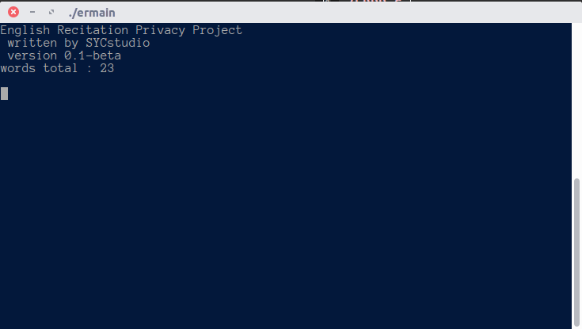
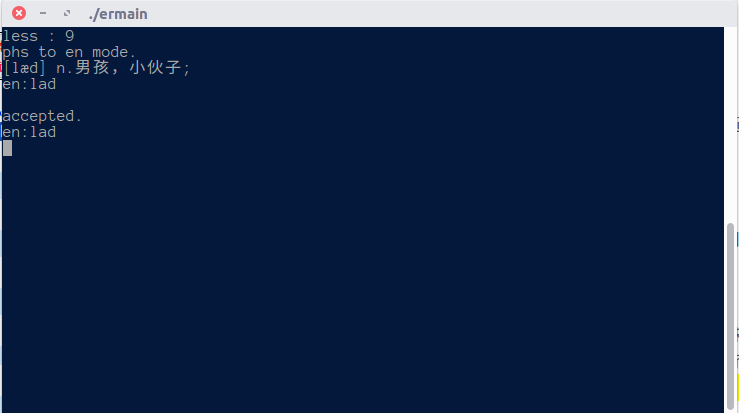

# English Recitation Privacy Project 

 > project start : 2018.11.28  
language : c++  
operating system : Ubuntu 16.04-3 LTS  
coding system : UTF-8

正在背单词，想找个东西帮助背记，别人的工具用起来也不顺手~~（主要是不能在linux上玩）~~，索性造个轮子。

OI 党，不会图形界面，所以只是简单的 Terminal program ，也没有用什么奇怪的库，反正用 g++ 5.4.0 就可以编译了。~~你甚至可以在CCF老(shao)爷机上跑~~

所用测试英文单词来自~~正在背的~~《四级词汇 词根+联想记忆法（乱序版）》 ~~不是打广告~~

## v0.1-beta
 > 2018.11.29

假装会一点美工，简单的调了一下输出格式，看起来好看些了。~~控制台里能怎么样啊~~  
加了个列表格的功能，另外英文能够判断拼写正误了。~~没错是Accepted~~  
~~一边开发一边用的好处就是可以实施调BUG...~~  
大概是一个能用的版本了

放个截图

## v0.1-alpha
 > 2018.11.28

仅仅只是能跑起来了~~厚颜无耻地试了下release功能~~

